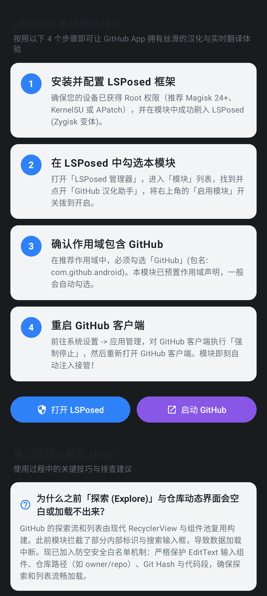
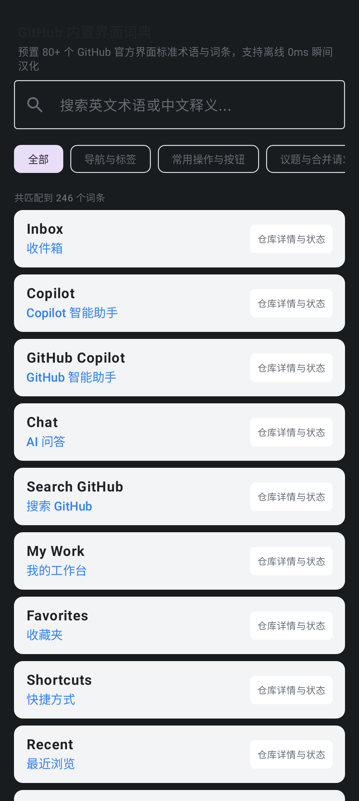

# GitHub 汉化助手 (GitHub App Localization & ML Kit AI Translation)

<p align="center">
  
</p>

<p align="center">
  <a href="https://developer.android.com"></a>
  <a href="https://kotlinlang.org"></a>
  <a href="https://developer.android.com/jetpack/compose"></a>
  <a href="https://github.com/LSPosed/LSPosed"></a>
  <a href="https://developers.google.com/ml-kit"></a>
  <a href="https://opensource.org/licenses/MIT"></a>
</p>

专为 Android 官方 **GitHub 客户端 (`com.github.android`)** 打造的高性能、无侵入式 **LSPosed 汉化增强模块与配置中心**。基于现代 Jetpack Compose 与 Material 3 设计，集成 **Google ML Kit 端侧离线神经网络 (Transformer)** 与多通道极速翻译引擎，让移动端开源探索如行云流水。

---

## 🌟 核心特性 (Key Features)

- **⚡ 0ms 极速本地 UI 汉化**：
  内置丰富的高频 GitHub 专有开源开发词典，对底栏导航、个人资料、仓库菜单、按钮状态、标签等进行精确到毫秒级的即时汉化替换。
- **🧠 Google ML Kit 端侧 AI 离线翻译 (~30MB)**：
  集成 Google 移动端量化 Transformer 神经机器翻译模型。下载到本地后 **100% 离线运行**，断网无障碍使用，零流量消耗、免去任何 API Key 配置。
- **🌐 多通道高速在线翻译备援**：
  国内免 Key 高速直连通道、百度翻译开放平台与 DeepL API，支持长句、README、Issue 和 Commit 讨论深度翻译。
- **📖 双语对照自由排版**：
  独家提供「双语对照」与「纯中文替换」模式自由切换，在保证高效阅读的同时保留英文代码专有名词对照。
- **💾 Room 本地智能持久化缓存**：
  自动保存已翻译结果至本地 SQLite 数据库，避免对同一仓库的重复请求，极大提升二次浏览流畅度并节省流量。
- **🔍 动态视图与 Epoxy 深度适配**：
  不仅 Hook 基础控件与 Webview，同时深度监听 Epoxy / RecyclerView 异步瀑布流与复杂嵌套列表，滑动即汉化。
- **🎨 现代伴侣管理应用**：
  提供模块激活状态自检、翻译缓存统计与一键清理、引擎测速沙盒以及 500+ 条开源词典检索面板。

---

## 📸 应用截图 (Screenshots)

| 激活与使用指南 (Guide) | 词条词典检索库 (Dictionary) |
| :---: | :---: |
|  |  |

---

## 🏗️ 架构与翻译调度工作流

```
                    GitHub 客户端 UI (TextView / Epoxy / WebView)
                                       │
                                       ▼
                       GitHubHookEntry (LSPosed 拦截器)
                                       │
            ┌──────────────────────────┴──────────────────────────┐
            ▼                                                     ▼
     静态词条映射匹配 (0ms)                                动态内容与长文段落
 (主页/Tab/按钮/状态/菜单)                                          │
            │                                                     ▼
            │                                           Room 本地持久化缓存检查
            │                                                     │
            │                                      ┌──────────────┴──────────────┐
            │                                      ▼ 命中                         ▼ 未命中
            │                                直接返回译文                 翻译引擎调度中心 (TranslationService)
            │                                                             │
            │                                         ┌───────────────────┼───────────────────┐
            │                                         ▼                   ▼                   ▼
            │                                   Google ML Kit        国内高速直连通道      Baidu / DeepL
            │                                (本地端侧 AI 推理)        (免Key备援)         (自定义Key)
            │                                         │                   │                   │
            └─────────────────────────────────────────┴───────────────────┴───────────────────┘
                                                       │
                                                       ▼
                                            写入 Room 本地缓存加速
                                                       │
                                                       ▼
                                             渲染至 GitHub 界面
```

---

## 🚀 安装与使用指南 (Getting Started)

### 前置环境需求
1. **已获取 Root 权限的 Android 设备**（推荐使用 Magisk 24+、KernelSU 或 APatch）；
2. **已刷入 LSPosed 框架**（推荐 Zygisk 变体版本）；
3. **已安装官方 GitHub Android 客户端**（包名：`com.github.android`）。

### 激活步骤
1. 下载并安装本模块的最新 APK（`GitHub 汉化助手`）；
2. 打开 **LSPosed 管理器**，在「模块」列表中找到 **GitHub 汉化助手**；
3. 打开模块详情，将右上角开关切换至 **启用**，并在生效应用列表中确认已勾选 **GitHub**；
4. 强行停止或重启 GitHub App，打开即可体验全中文汉化界面；
5. 打开「GitHub 汉化助手」主程序：
   - 切换至 **「引擎」** 页面，可选择 **Google ML Kit (端侧 AI 离线模型)** 并点击下载语言包；
   - 支持自由开启或关闭「双语对照模式」与「缓存加速」。

---

## 🛠️ 构建与编译 (Building)

本项目使用现代 Android Gradle 与 Kotlin DSL 开发：

```bash
# 克隆代码仓库
git clone https://github.com/your-username/github-chinese-assistant.git
cd github-chinese-assistant

# 编译 Debug APK
gradle :app:assembleDebug

# 运行本地自动化测试与 Robolectric 验证
gradle :app:testDebugUnitTest

# 录制 / 校验界面快照
gradle :app:recordRoborazziDebug
```

编译输出的 APK 位于 `app/build/outputs/apk/debug/app-debug.apk`。

---

## 🔒 隐私与安全声明 (Privacy & Security)

- **完全开源安全**：本模块不收集任何个人账号密码、Token、浏览记录或敏感信息。
- **本地优先**：在使用「Google ML Kit」或「内置词典」模式时，所有操作均 100% 在设备本地执行，零数据外发。

---

## 📄 开源许可证 (License)

本项目基于 [MIT License](LICENSE) 协议开源。欢迎提交 Issue 与 Pull Request 共同改进！
